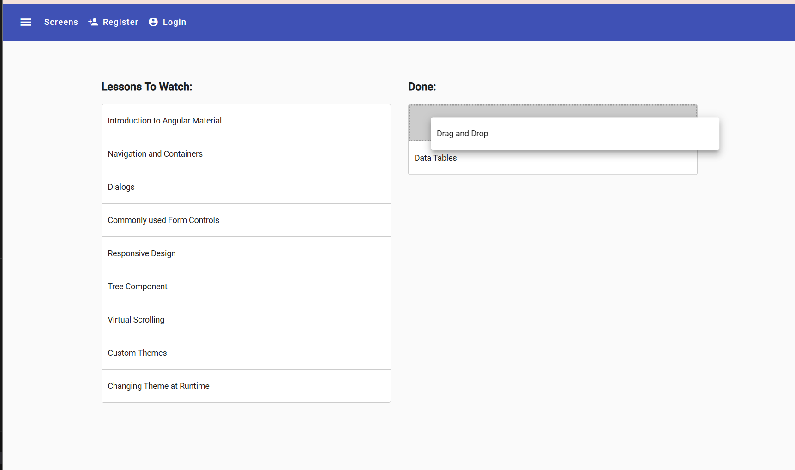
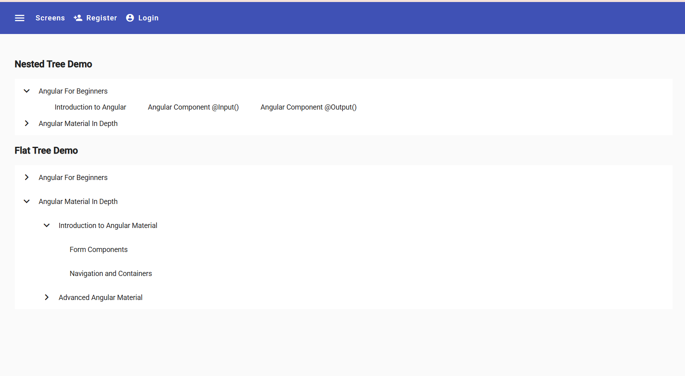

# course_register
A web application for course registration, I created it to explore the Angular Material components, the repo is updated to Angular 19, all components are standalone components.

I have already deployed this app on Firebase, will add more features in the future, because it can be easily extented to a full stack application.

Check the link to explore the Angular Material components: https://course-register-e5ab4.web.app

# Installation pre-requisites

 Node.js

# Installing the Angular CLI

With the following command the angular-cli will be installed globally in your machine:

    npm install -g @angular/cli 

# To Run the Development Backend Server

I created a simple server with node express api, our Angular frontend connects to it, running also in your local development machine.

We can start the sample application backend with the following command:

    npm run server

# To run the Development UI Server

Once the backend server is up and running, we can now run our frontend server. 

To run the frontend part of our code, we will use the Angular CLI:

    npm start 

The application is visible at port 4200: [http://localhost:4200](http://localhost:4200)

Note: **make sure to use command npm start and not ng serve, as npm start adds a couple extra options that are needed for our project **

# Components

this section is to showcase the components that I used in this project:

## side nav bar

## drop down menu

## tab and card

## stepper, input, radio, select box, date picker, check box, text area

## tooltip

## data table, spinner, paginator, sorting, multi-template data rows, expandable rows, data table selection, sticky header

## drap and drop

## responsive screen

## nested tree and flat tree

## virtual scrolling
